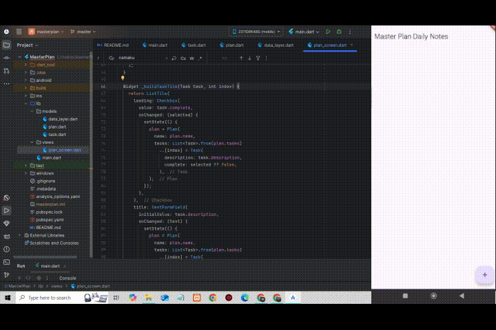
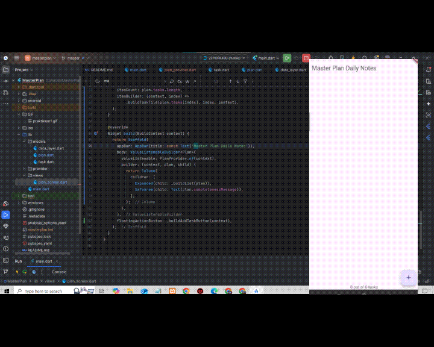
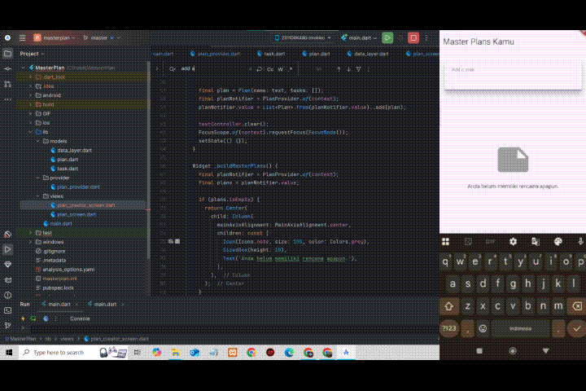

# flutter_masterplan

A new Flutter project.

## GIF Praktikum 1

## GIF Praktikum 2

## GIF Praktikum 3

---

## 📚 PRAKTIKUM

---

### 🧪 Tugas Praktikum 1: Dasar State dengan Model-View

1. Selesaikan langkah-langkah praktikum tersebut, lalu dokumentasikan berupa GIF hasil akhir praktikum beserta penjelasannya di file README.md! Jika Anda menemukan ada yang error atau tidak berjalan dengan baik, silahkan diperbaiki.
2. Jelaskan maksud dari langkah 4 pada praktikum tersebut! Mengapa dilakukan demikian?
3. Mengapa perlu variabel `plan` di langkah 6 pada praktikum tersebut? Mengapa dibuat konstanta?
4. Lakukan capture hasil dari Langkah 9 berupa GIF, kemudian jelaskan apa yang telah Anda buat!
5. Apa kegunaan method pada Langkah 11 dan 13 dalam lifecycle state?

---

### 🧪 Tugas Praktikum 2: InheritedWidget

1. Selesaikan langkah-langkah praktikum tersebut, lalu dokumentasikan berupa GIF hasil akhir praktikum beserta penjelasannya di file README.md! Jika Anda menemukan ada yang error atau tidak berjalan dengan baik, silakan diperbaiki sesuai dengan tujuan aplikasi tersebut dibuat.
2. Jelaskan mana yang dimaksud InheritedWidget pada langkah 1 tersebut! Mengapa yang digunakan InheritedNotifier?
3. Jelaskan maksud dari method di langkah 3 pada praktikum tersebut! Mengapa dilakukan demikian?
4. Lakukan capture hasil dari Langkah 9 berupa GIF, kemudian jelaskan apa yang telah Anda buat!

---

### 🧪 Tugas Praktikum 3: State di Multiple Screens

1. Selesaikan langkah-langkah praktikum tersebut, lalu dokumentasikan berupa GIF hasil akhir praktikum beserta penjelasannya di file README.md! Jika Anda menemukan ada yang error atau tidak berjalan dengan baik, silahkan diperbaiki sesuai dengan tujuan aplikasi tersebut dibuat.
2. Berdasarkan Praktikum 3 yang telah Anda lakukan, jelaskan maksud dari gambar diagram berikut ini!
3. Lakukan capture hasil dari Langkah 14 berupa GIF, kemudian jelaskan apa yang telah Anda buat!

---

## ✅ JAWABAN

---

### ✅ Jawaban Praktikum 1

1. **Telah Terselesaikan Tanpa Error**  
   Praktikum 1 berhasil dijalankan tanpa error. Aplikasi sudah dapat menampilkan daftar task, menambahkan task baru, mencentang task, serta UI secara otomatis menyesuaikan berdasarkan perubahan state.

2. **Penjelasan Langkah 4**  
   Pada langkah ini dibuat dua model: `Task` dan `Plan`.  
   - `Task` adalah satu tugas individu dengan deskripsi dan status selesai.
   - `Plan` adalah kumpulan dari beberapa `Task`.  
   Tujuannya adalah menerapkan prinsip *separation of concerns*, yaitu memisahkan antara logika data dan UI agar lebih terstruktur dan mudah dikelola. Model juga mempermudah testing serta maintainability ke depannya.

3. **Penggunaan Variabel `plan`**  
   Variabel `plan` menyimpan state utama, yaitu daftar task. Variabel ini dibuat dengan `const` karena objek `Plan` bersifat immutable. Untuk memperbarui data, objek baru akan dibuat. Ini mendorong pola reactive programming yang konsisten dan lebih efisien dalam pembaruan UI.

4. **Penjelasan Langkah 9 dan GIF**  
   Pada langkah ini, aplikasi sudah bisa menambahkan task baru dengan tombol tambah (+).  
   GIF memperlihatkan:
   - Menambah task
   - Mengisi deskripsi
   - Mencentang/menghapus centang dari task  
   Semua ini mencerminkan bagaimana state bekerja dan memicu rebuild UI dengan `setState`.

5. **Fungsi Lifecycle State**  
   - `initState()`: Dipakai untuk inisialisasi `ScrollController`, serta menambahkan listener untuk menutup keyboard saat scroll. Ini hanya dipanggil sekali saat widget dibuat.  
   - `dispose()`: Dipakai untuk membersihkan `ScrollController` saat widget dihapus. Ini mencegah memory leak dan meningkatkan efisiensi.

---

### ✅ Jawaban Praktikum 2

1. **Telah Terselesaikan Tanpa Error**  
   Praktikum 2 berjalan lancar. Aplikasi berhasil memanfaatkan `InheritedNotifier` untuk mengelola dan membagikan state ke widget lainnya tanpa perlu `setState`. Semua fitur dapat berjalan sesuai rencana dan efisien.

2. **InheritedWidget & Penggunaan InheritedNotifier**  
   `PlanProvider` adalah turunan dari `InheritedNotifier`, yang merupakan bentuk spesifik dari `InheritedWidget`.  
   `InheritedNotifier` dipilih karena lebih praktis: ketika `ValueNotifier` berubah, maka `InheritedNotifier` otomatis memberi tahu widget turunan yang membutuhkan update. Ini efisien dibanding update manual dengan `setState`.

3. **Penjelasan Method di Langkah 3**  
   - `completedCount`: Menghitung jumlah task yang selesai.
   - `completenessMessage`: Memberi teks “X out of Y tasks”.  
   Tujuannya adalah menyederhanakan proses penampilan informasi status di UI. Jadi UI tidak perlu hitung manual lagi, cukup panggil method-nya.

4. **Penjelasan Langkah 9 dan GIF**  
   GIF memperlihatkan:
   - User mencentang task
   - Jumlah task selesai otomatis diperbarui di UI  
   Ini menunjukkan penggunaan state yang reaktif: perubahan data langsung memicu rebuild UI melalui `ValueListenableBuilder` yang mendengarkan perubahan `Plan`.

